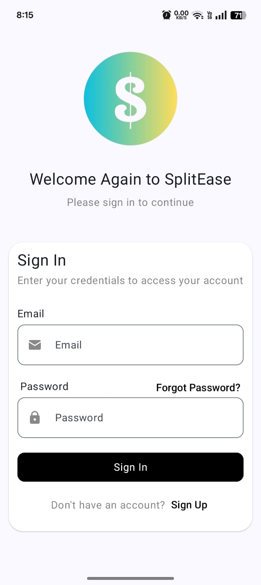
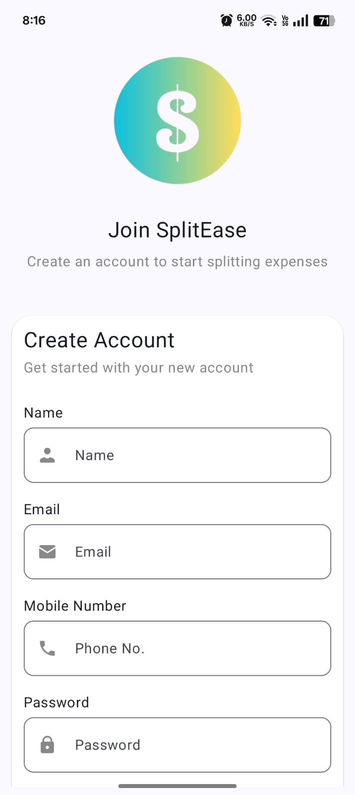
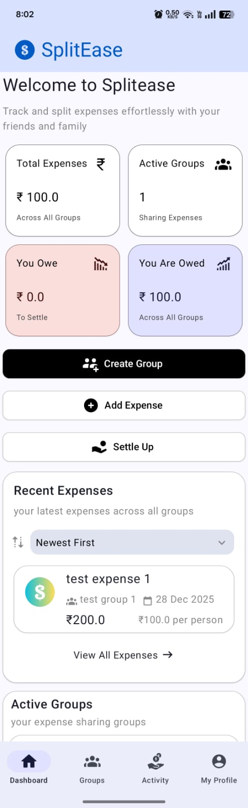
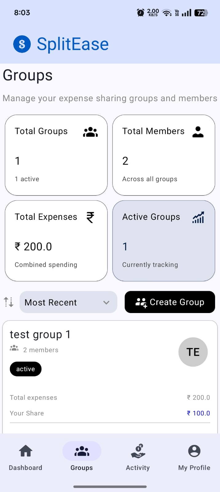
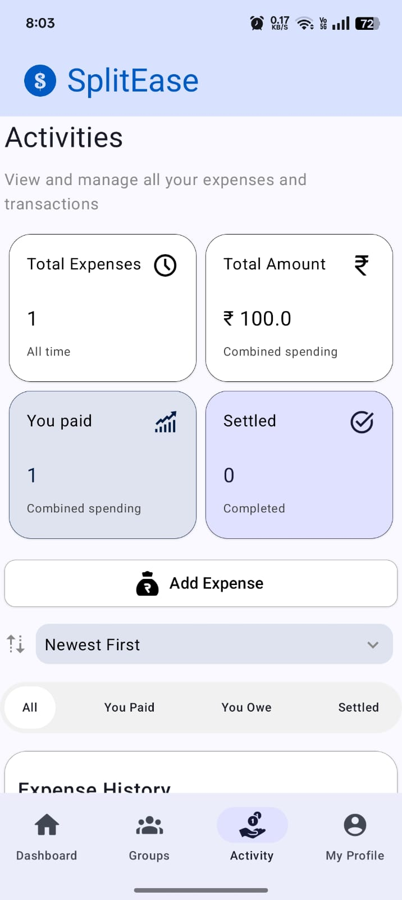
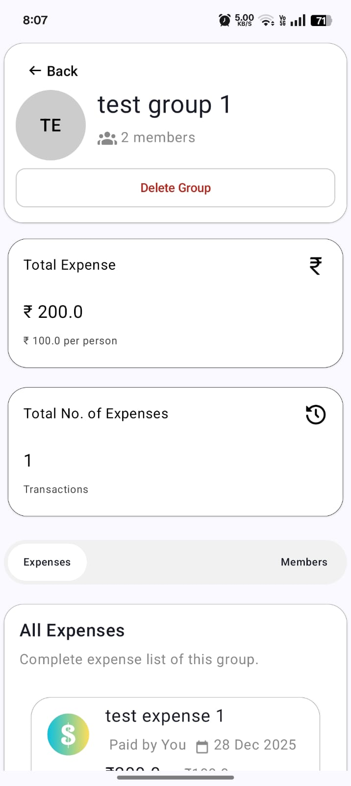
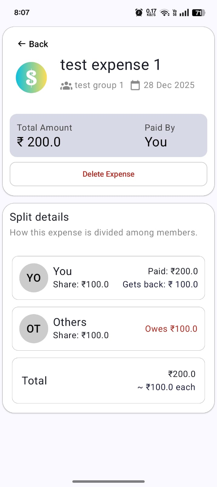
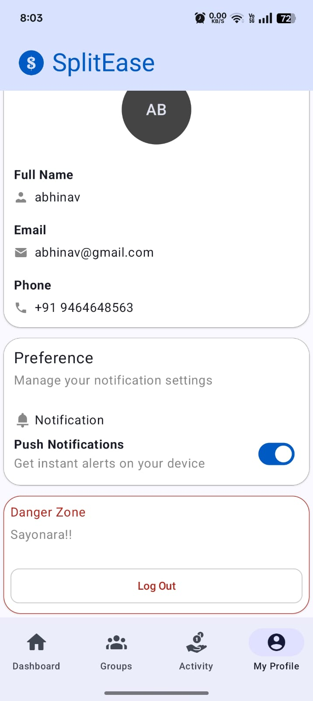

# SplitEase: An Expense Splitting and Tracking Application

SplitEase is a full-stack Android application for managing and splitting group expenses. It enables users to create groups, add shared expenses, and automatically compute peer-to-peer net settlements across multiple groups. The app emphasizes secure authentication, accurate balance calculation, and real-time updates.

## App Screenshots
<p align="center">
  
  
</p>

<p align="center">
  
  
  
</p>

<p align="center">
   
  
   
</p>   


## Key Features
- **Collaborative Expense Management**: Engineered a full-stack system for real-time group expense tracking and ledger management using Spring Boot and PostgreSQL.
- **Algorithmic Settlement Engine**: Designed and implemented a complex settlement logic to compute net peer-to-peer balances across multiple groups, optimizing for minimum transaction counts.
- **Security Framework**: Integrated industry-standard security protocols, including JWT (JSON Web Tokens) for stateless authentication and BCrypt hashing for sensitive data protection.
- **Modern Android Architecture**: Developed a responsive, reactive UI using Jetpack Compose following MVVM principles and Clean Architecture to ensure high scalability and maintainability.
- **Real-time Event Notifications**: Leveraged Firebase Cloud Messaging (FCM) to architect a low-latency notification system for instant expense updates and settlement alerts.
- **Scalable Networking & DI**: Streamlined API communication using Retrofit and managed app-wide dependencies with Hilt for a modular codebase.


## Tech Stack

### Frontend
- Android (Kotlin)
- Jetpack Compose
- MVVM Architecture
- Retrofit
- Hilt
- Firebase Cloud Messaging (FCM)

### Backend
- Spring Boot
- Spring Security
- JWT Authentication
- PostgreSQL
- JPA / Hibernate

## Getting Started

### Prerequisites
- Android Studio (latest stable)
- JDK 17+
- PostgreSQL
- Gradle

### 1. Clone the Repository
```bash
git clone https://github.com/unleashedme/SplitEase.git
cd SplitEase
```

### 2. Frontend Setup
- Open the `android/` module in Android Studio  
- Let Gradle sync complete  
- Add `google-services.json` for Firebase Cloud Messaging  
- Update the API base URL in the network configuration  
- Build and run the app on an emulator or physical device  

### 3. Backend Setup
- Open the `backend/` module in your IDE  
- Create a PostgreSQL database for the project  
- Update database credentials in `application.yml`  
- Ensure JDK 17+ is configured  
- Run the Spring Boot application (default port: 8080)

## Project Structure
```bash
SplitEase/
├── android/                 # Android frontend
│   ├── ui/                  # Jetpack Compose UI
│   ├── viewmodel/           # ViewModels (MVVM)
│   ├── data/                # DTOs, repositories
│   └── di/                  # Hilt modules
├── backend/                 # Spring Boot backend
│   ├── controller/          # REST controllers
│   ├── service/             # Business logic
│   ├── repository/          # JPA repositories
│   ├── model/               # Entities & DTOs
│   └── security/            # JWT & security config
├── screenshots/             # App screenshots
└── README.md
```
